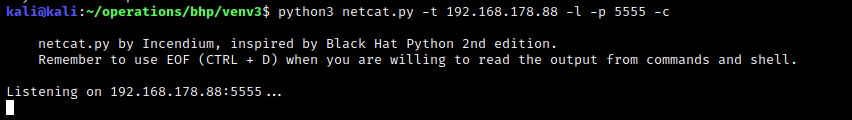
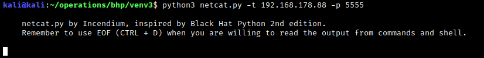
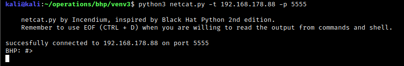

# PynetTools
Some usefull network tools for when you do not have access to basic tools.


## Tools included
### [TCP_client](https://github.com/1ncendium/PynetTools/blob/main/PynetTools/TCP_client.py)
Quickly setup your TCP_client, you can fill in the data that you want to send to the server.
- Usage: python3 TCP_client.py [target] [port]
- Example: python3 TCP_client.py 192.168.101.8 5555

### [UDP_client](https://github.com/1ncendium/PynetTools/blob/main/PynetTools/UDP_client.py)
Quickly setup your UDP_client, you can fill in the data that you want to send to the server.
- Usage: python3 UDP_client.py [target] [port]
- Example: python3 UDP_client.py 192.168.101.8 5555

### [TCP_server](https://github.com/1ncendium/PynetTools/blob/main/PynetTools/TCP_server.py)
Quickly setup your TCP_server, this script starts a listener for incoming requests
- Usage: python3 TCP_server.py [target] [port]
- Example: python3 TCP_server.py 192.168.101.8 5555

### [TCP_proxy](https://github.com/1ncendium/PynetTools/blob/main/PynetTools/TCP_proxy.py)
This tool will act like a proxy. This has many usefull examples like acting like a FTP server.
- Usage: python3 TCP_proxy.py [target] [port] [remote server] [remote port] [receive first]
- Example: python3 TCP_proxy.py 192.168.1.203 21 ftp.sun.ac.za 21 True.

[Receive first] must be True for FTP servers. Because most FTP servers first send a banner when connecting to it.

### [Netcat](https://github.com/1ncendium/PynetTools/blob/main/PynetTools/netcat.py)
Netcat like the famous netcat tool, can be used for reading from and writing to network connections.

- Usage: python3 netcat.py [-h] [-c] [-e EXECUTE] [-l] [-p PORT] [-t TARGET] [-u UPLOAD]
- -h / --help | for help.
- -c for command shell
- -e / --execute for executing commands
- -l / listening mode
- -p / --port specify port
- -t / --target specify target
- -u / --upload for uploading files

Example to setup a reverse shell:
- Server: python3 netcat.py -t 192.168.178.88 -l -p 5555 -c
- Client: python3 netcat.py -t 192.168.178.88 -p 5555

Now the client will receive a shell from the server and can interact with it.

- Steps:

1.0 Setup the server listener + -c parameter for command shell


2.0 Setup the client to connect to that command shell of the server


3.0 Specify EOF with CTRL + D in order to receive the command shell


## Prerequisites
Before you begin, ensure you have met the following requirements:

- Python 3.6+

## Downloading the tools

Linux :
```
git clone https://github.com/1ncendium/PynetTools.git
```
Windows :
```
Download the repository from https://github.com/1ncendium/PynetTools/archive/refs/heads/main.zip
```

### Disclaimer
All of the tools are inspired by the book, Black Hat Python 2nd edition. But I've given my own touch to it.
